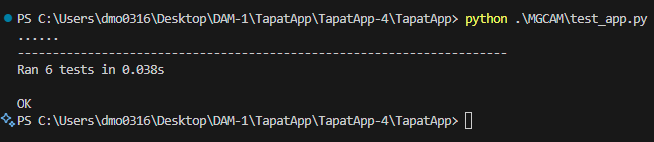

# 📸 Gestor de Imágenes con Login de Usuarios
Este proyecto es una aplicación desarrollada en Python que permite la gestión dinámica de imágenes a través de una interfaz sencilla y personalizada según el usuario que inicia sesión.

## 🛠️ Características principales
- 🔐 Autenticación de usuarios

El sistema implementa un mecanismo de autenticación basado en credenciales, donde los usuarios deben ingresar su nombre de usuario y contraseña para acceder a las funcionalidades protegidas. La contraseña se almacena utilizando una función hash (MD5 en este caso), mejorando así la seguridad frente a accesos no autorizados.

- 👥 Registro de Nuevos Usuarios

La aplicación permite el alta de nuevos usuarios a través de un formulario que recoge nombre completo, nombre de usuario y contraseña. Durante este proceso, se valida la información proporcionada y se almacena de forma segura en la base de datos.

- 🖼️ Visualización de imágenes según el usuario autenticado

Una vez autenticado, el usuario puede visualizar las imágenes asociadas a su cuenta. Cada imagen contiene información relevante como título, descripción, ruta de almacenamiento y fecha de subida. Las imágenes se recuperan dinámicamente desde la base de datos y se presentan en una galería estructurada. Esta funcionalidad puede ampliarse para incluir operaciones de CRUD (crear, leer, actualizar, eliminar) sobre las imágenes.

-  👨 Gestión de usuarios

El sistema mantiene una tabla de usuarios que permite la autenticación, visualización y gestión básica del perfil del usuario autenticado. Se gestionan las sesiones mediante cookies seguras, y se incluye la opción de cerrar sesión para invalidar el acceso.

-  🔧 CRUD Usuario Administrador

 Cuando un administrador inicia sesión, se le habilitan funcionalidades avanzadas de gestión. Estas incluyen:

- Gestión de Usuarios (CRUD): el administrador puede crear, leer, actualizar y eliminar registros de usuarios desde una interfaz dedicada. Esto permite un control completo sobre el acceso a la plataforma.

- Gestión de Imágenes (CRUD): el administrador también puede realizar operaciones de mantenimiento sobre las imágenes subidas por cualquier usuario. Puede visualizar, modificar metadatos, eliminar imágenes o asociarlas a distintos usuarios si es necesario.

# ⚙️ Requisitos Técnicos
## 🎨 Frontend
### Wireframes/Interfaz:

- HTML + CSS básico (Flask)

- Estilo simple y responsive con CSS

### Arquitectura de carpetas:

- /templates → Archivos .html (renderizados por Flask)

- /static → Imágenes, CSS y otros recursos estáticos

### Ruta de imágenes:

- Las imágenes se cargan desde static/uploads/

- Se muestran dinámicamente en home.html según el usuario conectado

### Navegación/Flujo:

- Pantalla de login

- Vista principal (home.html) tras inicio de sesión

- Visualización de imágenes asociadas al usuario

## 🖥️ Backend
### Lenguaje:

- Python 3.x

### Framework:

- Flask (aplicacion ligera, manejo de rutas y gestión de sesiones)

### Base de datos:

- MySQL (almacenamiento estructurado de usuarios e imágenes)

- Conexión mediante mysql-connector-python o similar

### Control de versiones:

- Git + GitHub (versionar el código y colaborar)

### Testing:

- unittest para validar la lógica del backend y endpoints

### Seguridad:

- Contraseñas encriptadas (con MD5)

## Modelo E/R

## Diagrama de arquitectura

# 🔌 End-points WebService

| **Método** | **Endpoint**       | **Función**                                                   |
|------------|--------------------|----------------------------------------------------------------|
| `POST`     | `/login`           | Inicia sesión de usuario con nombre de usuario y contraseña (MD5). |
| `POST`     | `/register`        | Registra un nuevo usuario en la base de datos.                |
| `GET`      | `/imagenes`        | Lista imágenes visibles según el usuario autenticado.         |
| `POST`     | `/imagenes`        | Sube una nueva imagen (requiere permisos especiales, ej. admin). |
| `GET`      | `/perfil`          | Devuelve la información del perfil del usuario actual.        |
| `PUT`      | `/perfil`          | Permite modificar los datos del perfil del usuario.           |
| `POST`     | `/logout`          | Cierra la sesión del usuario actual.                          |

## Diagrama de clases BackEnd

[Codigo](diagramaaaa.mmd)

## Diagrama de clases FrontEnd

[Codigo](DFrontEnd.mmd)

### Login

### Registro

### Login completado

## Test Unitari
[Codigo de test_app](test_app.py)

### Creado por Daniel Montes y Jose Gomez - 2025
